+++

title = "eBPF"
description = "it.os.linux.eBPF"
tags = ["it","os","linux"]

+++


# eBPF

> [官网](https://ebpf.io/)；
>
> 
>
> [eBPF 和 XDP 参考指南](https://cilium.readthedocs.io/en/stable/bpf/) & [翻译](https://arthurchiao.art/blog/cilium-bpf-xdp-reference-guide-zh/)；
>
> [bpf-helpers](https://man7.org/linux/man-pages/man7/bpf-helpers.7.html)；
>
> [BPF 程序类型详解](https://arthurchiao.art/blog/bpf-advanced-notes-1-zh/)；
>
> [BPF Map 类型详解](https://arthurchiao.art/blog/bpf-advanced-notes-2-zh/)；
>
> 
>
> [iovisor/bcc](iovisor/bcc)；
>
> 使用 python 开发 eBPF 程序；
>
> 
>
> [cilium/ebpf](cilium/ebpf)；
>
> [iovisor/gobpf](https://github.com/iovisor/gobpf)；
>
> [使用 Go 语言开发 eBPF 程序](https://www.sobyte.net/post/2022-04/go-ebfp/)；

## 简介

> [eBPF简介](https://ebpf.io/what-is-ebpf#introduction-to-ebpf)；


## 过程




## 技术栈

> [[译] BPF 可移植性和 CO-RE (compile once - run everywhere)](http://arthurchiao.art/blog/bpf-portability-and-co-re-zh/)；[BPF Portability and CO-RE](https://facebookmicrosites.github.io/bpf/blog/2020/02/19/bpf-portability-and-co-re.html)；




## CO-RE

### BTF

检查BTF开启

```shell
$ cat /boot/config-`uname -r` | grep BTF
CONFIG_VIDEO_SONY_BTF_MPX=m
CONFIG_DEBUG_INFO_BTF=y
CONFIG_PAHOLE_HAS_SPLIT_BTF=y
CONFIG_DEBUG_INFO_BTF_MODULES=y
```

### vmlinux.h

```shell
# 生成vmlinux.h
$ bpftool btf dump file /sys/kernel/btf/vmlinux format c > vmlinux.h
```


## BPF prog

```c
#include "vmlinux.h"

#include <bpf/bpf_helpers.h>
#include <bpf/bpf_tracing.h>

SEC("<bpf_type>/<trace_name>")
int kprobe__do_sys_openat2(struct pt_regs *ctx)
{
    char file_name[256];
    bpf_probe_read(file_name, sizeof(file_name), PT_REGS_PARM2(ctx));

    char fmt[] = "open file %s\n";
    bpf_trace_printk(fmt, sizeof(fmt), &file_name);

    return 0;
}
```

vmlinux.h：见CO-RE vmlinux.h

bpf_type：不同的类型有不同的使用方式和限制，详见下面[eBPF类型](#eBPF类型)。

trace_name：对于

### 编译

```makefile
```


### 类型

### kprobes

```c
#include "vmlinux.h"

#include <bpf/bpf_helpers.h>
#include <bpf/bpf_tracing.h>

SEC("kprobe/do_sys_openat2")
int kprobe__do_sys_openat2(struct pt_regs *ctx)
{
    char file_name[256];
    bpf_probe_read(file_name, sizeof(file_name), PT_REGS_PARM2(ctx));

    char fmt[] = "open file %s\n";
    bpf_trace_printk(fmt, sizeof(fmt), &file_name);

    return 0;
}
```


### tracepoint

### raw_tracepoint

## BPF map


## vmlinux

## libbpfgo

> [aquasecurity/libbpfgo](https://github.com/aquasecurity/libbpfgo)：一个通过cgo调用libbpf库的go语言封装。
>
> [libbpfgo 使用示例：搭建开发环境以及编写第一个 ebpf 程序](https://mozillazg.com/2022/05/ebpf-libbpfgo-develop-env-and-hello-world.html)；
>
> [文档](https://libbpf.readthedocs.io/en/latest/program_types.html)；

### 依赖

```shell
# 安装：clang llvm elf bpftool
$ apt install -y clang llvm libelf-dev linux-tools-common
# 执行：仍收到以下提示
$ bpftool 
WARNING: bpftool not found for kernel 5.15.0-52

  You may need to install the following packages for this specific kernel:
    linux-tools-5.15.0-52-generic
    linux-cloud-tools-5.15.0-52-generic

  You may also want to install one of the following packages to keep up to date:
    linux-tools-generic
    linux-cloud-tools-generic
# 安装
$ apt install -y linux-tools-5.15.0-52-generic
```

### Makefile

```makefile
ROOT = ./
OUTPUT = ./build

$(OUTPUT):
	mkdir -p $(OUTPUT)

# ---------------- vmlinuxh
# vmlinuxh: vmlinux header file, generated by
# `bpftool btf dump file /sys/kernel/btf/vmlinux format c > OUTPUT/vmlinux.h`
.PHONY: vmlinuxh
VMLINUXH = $(OUTPUT)/vmlinux.h
BPFTOOL = $(shell which bpftool || /bin/false)
BTFFILE = /sys/kernel/btf/vmlinux
DBGVMLINUX = /usr/lib/debug/boot/vmlinux-$(shell uname -r)

vmlinuxh: $(VMLINUXH)
$(VMLINUXH): $(OUTPUT)
ifeq ($(wildcard $(BPFTOOL)),)
	@echo "ERROR: could not find bpftool"
	@exit 1
endif
	@if [ -f $(DBGVMLINUX) ]; then \
		echo "INFO: found dbg kernel, generating $(VMLINUXH) from $(DBGVMLINUX)"; \
		$(BPFTOOL) btf dump file $(DBGVMLINUX) format c > $(VMLINUXH); \
	fi
	@if [ ! -f $(BTFFILE) ] && [ ! -f $(DBGVMLINUX) ]; then \
		echo "ERROR: kernel does not seem to support BTF"; \
		exit 1; \
	fi
	@if [ ! -f $(VMLINUXH) ]; then \
		echo "INFO: generating $(VMLINUXH) from $(BTFFILE)"; \
		$(BPFTOOL) btf dump file $(BTFFILE) format c > $(VMLINUXH); \
	fi

# ---------------- c
# C
CC = gcc
CFLAGS = -ggdb -gdwarf -O2 -Wall -fpie -Wno-unused-variable -Wno-unused-function

# ---------------- libbpf
# libbpf: default static libbpf
LIBBPF_SRC = $(abspath ./3rdparty/libbpf/src)
LIBBPF_DST = $(abspath $(OUTPUT)/libbpf)
GIT = $(shell which git || /bin/false)

$(LIBBPF_SRC):
ifeq ($(wildcard $@), )
	echo "INFO: updating submodule 'libbpf'"
	$(GIT) submodule update --init --recursive
endif
$(LIBBPF_DST):
	mkdir -p $(LIBBPF_DST)

.PHONY: libbpf
libbpf: libbpf-static

# ---------------- ---------------- libbpf static
# libbpf static: static libbpf generation for the git submodule
LIBBPF_DESTDIR = $(abspath $(OUTPUT))
LIBBPF_OBJDIR = $(abspath $(OUTPUT)/libbpf)
LIBBPF_OBJ = $(abspath $(LIBBPF_OBJDIR)/libbpf.a)
LDFLAGS =

.PHONY: libbpf-static
libbpf-static: $(LIBBPF_OBJ)
$(LIBBPF_OBJ): $(LIBBPF_SRC) $(wildcard $(LIBBPF_SRC)/*.[ch]) | $(LIBBPF_DST)
	CC="$(CC)" CFLAGS="$(CFLAGS)" LD_FLAGS="$(LDFLAGS)" \
	$(MAKE) -C $(LIBBPF_SRC) \
		BUILD_STATIC_ONLY=1 \
		DESTDIR=$(LIBBPF_DESTDIR) \
		OBJDIR=$(LIBBPF_OBJDIR) \
		INCLUDEDIR= LIBDIR= UAPIDIR= prefix= libdir= \
		install

# ---------------- ---------------- libbpf dynamic
# libbpf dynamic:
CGO_CFGLAGS_DYN = "-I. -I/usr/include/"
CGO_LDFLAGS_DYN = "-lelf -lz -lbpf"
CGO_EXTLDFLAGS_DYN = '-w'

.PHONY: libbpf-dynamic
libbpf-dynamic:
	echo nothing

# ---------------- program
PROGRAM = ytrace

# ---------------- bpf program
# bpf prog: clang -O2 -Wall -target bpf
CLANG = clang
BPF_SRC = $(abspath $(ROOT)/pkg/bpf)
BPF_CFLAGS_STATIC = "-I$(abspath $(OUTPUT))"
BPF_LDFLAGS_STATIC = "-lelf -lz $(LIBBPF_OBJ)"

.PHONY: $(PROGRAM).bpf.c
$(PROGRAM).bpf.o: $(PROGRAM).bpf.c | vmlinuxh
	$(CLANG) -D__TARGET_ARCH_x86 \
		$(CFLAGS) -target bpf -I. -I$(OUTPUT) \
		-c $< -o $@

# ---------------- go program
# go prog
OS := $(shell uname -s)
ARCH := $(shell uname -m)
ARCH := $(subst x86_64,amd64,$(ARCH))
GOARCH := $(ARCH)
CGO_CFLAGS_STATIC = "-I$(abspath $(OUTPUT))"
CGO_LDFLAGS_STATIC = "-lelf -lz $(LIBBPF_OBJ)"
CGO_EXTLDFLAGS_STATIC = '-w -extldflags "-static"'

.PHONY: $(PROGRAM)
$(PROGRAM): libbpf | $(PROGRAM).bpf.o
	CC=$(CLANG) GOOS=linux GOARCH=$(GOARCH) \
	CGO_CFLAGS=$(CGO_CFLAGS_STATIC) CGO_LDFLAGS=$(CGO_LDFLAGS_STATIC) \
	go build -tags netgo -ldflags $(CGO_EXTLDFLAGS_STATIC) \
		-o $(PROGRAM) ./$(PROGRAM).go

# ---------------- all
all:
	$(MAKE) -C . $(PROGRAM)

# ---------------- clean
clean:
	$(MAKE) -C $(LIBBPF_SRC) clean
	rm -rf $(OUTPUT)
	rm -rf $(VMLINUXH)
	rm -rf $(PROGRAM) $(PROGRAM)-*static $(PROGRAM)-*dynamic
	rm -rf $(PROGRAM).bpf.o $(PROGRAM).o

```


ebpf/c/

```c
#include "vmlinux.h"

#include <bpf/bpf_helpers.h>
#include <bpf/bpf_tracing.h>

SEC("kprobe/do_sys_openat2")
int kprobe__do_sys_openat2(struct pt_regs *ctx)
{
    char file_name[256];
    bpf_probe_read(file_name, sizeof(file_name), PT_REGS_PARM2(ctx));

    char fmt[] = "open file %s\n";
    bpf_trace_printk(fmt, sizeof(fmt), &file_name);

    return 0;
}
```

```shell
clang -D__TARGET_ARCH_x86 -I. -I../c/  -target bpf -c bpf.o.c -o bpf.o
```


## 实验：基于 eBPF 的网络观测

> [Linux网络新技术基石：eBPF and XDP](https://blog.csdn.net/flynetcn/article/details/119487894)；


## tracee二次开发

> [aquasecurity/tracee](https://github.com/aquasecurity/tracee)：使用 Linux **eBPF 技术**在运行时**跟踪您的系统和应用程序，并分析收集的事件以检测**可疑的行为模式。
>
> tracee 依赖于 libbpf

### libbpf

> [libbpf](https://github.com/libbpf/libbpf)：可以构建支持 [BPF CO-RE(Compile Once – Run Everywhere)](https://github.com/libbpf/libbpf#bpflibbpf-usage-and-questions) 的高可移植性 BPF 程序。与 [BCC](https://github.com/iovisor/bcc/) 相比，它不需要将 Clang/LLVM 运行时部署到目标服务器，并且不依赖于可用的内核开发头文件。
>
> BTF：libbpf 依赖于内核 BTF，RHEL 8.2+、Ubuntu 20.10 等发行版都已经内置内核 BTF；内核 BTF 需要在**编译**内核时设置`CONFIG_DEBUG_INFO_BTF=y`构建选项；通过查看是否存在文件`/sys/kernel/btf/vmlinux`以检查内核是否内置 BTF


安装

```shell
# 

# libbpf 在 tracee 项目 make 中的安装方式
CC="clang" \
CFLAGS=""-fPIC"" \
LD_FLAGS="" \
make \
-C ./3rdparty/libbpf/src \
BUILD_STATIC_ONLY=1 \
DESTDIR=/root/projects/github.com/tracee/dist/libbpf \
OBJDIR=/root/projects/github.com/tracee/dist/libbpf/obj \
INCLUDEDIR= LIBDIR= UAPIDIR= prefix= libdir= \
install install_uapi_headers
```

### 启动流程

### 追踪流程

### 实现新的追踪

tracee 实现了 vfs_write 追踪但并没有实现 vfs_read 追踪，这里参考 vfs_write 追踪**实现 vfs_read 追踪**。得益于 tracee 的代码可扩展性，只需要如下两步：

1. 在 go 代码中添加 vfs_read 事件定义

```go
// pkg/events/events.go

const (
	VfsRead  // 添加 vfs_read 事件ID
    VfsWrite
)

var Definitions = eventDefinitions{
	events: map[ID]Event{
        // 参考 VfsWrite 定义实现 VfsRead 定义
        VfsRead: {
			ID32Bit: sys32undefined,
			Name:    "vfs_read",
			Probes: []probeDependency{
				{Handle: probes.VfsRead, Required: true},
				{Handle: probes.VfsReadRet, Required: true},
			},
			Sets: []string{},
			Params: []trace.ArgMeta{
				{Type: "const char*", Name: "pathname"},
				{Type: "dev_t", Name: "dev"},
				{Type: "unsigned long", Name: "inode"},
				{Type: "size_t", Name: "count"},
				{Type: "off_t", Name: "pos"},
				{Type: "unsigned int", Name: "flags"}, // 顺手添加一个 flags
			},
		},
        VfsWrite: { /*...*/ },
    }
}
```

```go
// pkg/ebpf/probes/probes.go

const (
	VfsRead    // 添加入参处理标识
    VfsReadRet // 添加出参处理标识
	VfsWrite
	VfsWriteRet
)

// Init initializes a Probes interface
func Init(module *bpf.Module, netEnabled bool) (Probes, error) {
	allProbes := map[Handle]Probe{
		VfsRead:                   &traceProbe{eventName: "vfs_read", probeType: kprobe, programName: "trace_vfs_read"},        // 注册入参探针
		VfsReadRet:                &traceProbe{eventName: "vfs_read", probeType: kretprobe, programName: "trace_ret_vfs_read"}, // 注册出参探针
		VfsWrite:                   &traceProbe{eventName: "vfs_write", probeType: kprobe, programName: "trace_vfs_write"},
		VfsWriteRet:                &traceProbe{eventName: "vfs_write", probeType: kretprobe, programName: "trace_ret_vfs_write"},
    }
}
```


2. 编写 bpf 代码

```c
// pkg/ebpf/c/tracee.bpf.c

enum tail_call_id_e // 原有内容
{
    TAIL_VFS_READ,
    TAIL_VFS_WRITE, // 原有内容
}

enum event_id_e // 原有内容
{
    VFS_READ,
    VFS_WRITE, // 原有内容
}

// 参考方法 get_inode_nr_from_file，通过宏 READ_KERN 获取，否则将报错寄存器内存未初始化
static __always_inline unsigned int get_flags_from_file(struct file *file)
{
    return READ_KERN(file->f_flags);
}

static __always_inline int
do_file_read_operation(struct pt_regs *ctx, u32 event_id, u32 tail_call_id)
{
    args_t saved_args;
    if (load_args(&saved_args, event_id) != 0) {
        // missed entry or not traced
        return 0;
    }

    int zero = 0;
    config_entry_t *config = bpf_map_lookup_elem(&config_map, &zero);
    if (config == NULL)
        return 0;

    if (!should_submit(VFS_READ, config)) {
        bpf_tail_call(ctx, &prog_array, tail_call_id);
        return 0;
    }

    loff_t start_pos;
    void *ptr;
    struct iovec *vec;
    size_t count;

    struct file *file = (struct file *) saved_args.args[0];
    void *file_path = get_path_str(GET_FIELD_ADDR(file->f_path));
    unsigned int flags = get_flags_from_file(file); // 顺手加个 flags

    ptr = (void *) saved_args.args[1];
    count = (size_t) saved_args.args[2];
    loff_t *pos = (loff_t *) saved_args.args[3];

    // Extract device id, inode number, and pos (offset)
    dev_t s_dev = get_dev_from_file(file);
    unsigned long inode_nr = get_inode_nr_from_file(file);
    bpf_probe_read(&start_pos, sizeof(off_t), pos);

    bool char_dev = (start_pos == 0);
    u32 bytes_read = PT_REGS_RC(ctx);

    // Calculate read start offset
    if (start_pos != 0)
        start_pos -= bytes_read;

    event_data_t data = {};
    if (!init_event_data(&data, ctx))
        return 0;

    if (should_submit(VFS_READ, data.config)) {
        save_str_to_buf(&data, file_path, 0);
        save_to_submit_buf(&data, &s_dev, sizeof(dev_t), 1);
        save_to_submit_buf(&data, &inode_nr, sizeof(unsigned long), 2);
        save_to_submit_buf(&data, &count, sizeof(size_t), 3);
        save_to_submit_buf(&data, &start_pos, sizeof(off_t), 4);
        save_to_submit_buf(&data, &flags, sizeof(int), 5); // flags

        // Submit vfs_read(v) event
        events_perf_submit(&data, event_id, PT_REGS_RC(ctx));
    }

    bpf_tail_call(ctx, &prog_array, tail_call_id);
    return 0;
}

SEC("kprobe/vfs_read")
TRACE_ENT_FUNC(vfs_read, VFS_READ);

SEC("kretprobe/vfs_read")
int BPF_KPROBE(trace_ret_vfs_read)
{
    return do_file_read_operation(ctx, VFS_READ, TAIL_VFS_READ);
}
```

重新编译并执行

```shell
$ make
make ./dist/tracee.bpf
clang \
	-D__TARGET_ARCH_x86 \
	-D__BPF_TRACING__ \
	-DCORE \
	-I./pkg/ebpf/c/ \
	-I./dist/tracee.bpf \
	-target bpf \
	-O2 -g \
	-march=bpf -mcpu=v2 \
	-c ./pkg/ebpf/c/tracee.bpf.c \
	-o dist/tracee.bpf.core.o
make ./dist/btfhub
make btfhub
GOOS=linux CC=clang GOARCH=amd64 CGO_CFLAGS="-I/root/projects/github.com/tracee/dist/libbpf" CGO_LDFLAGS="-lelf  -lz  /root/projects/github.com/tracee/dist/libbpf/libbpf.a" go build \
	-tags core,ebpf \
	-ldflags="-w \
		-extldflags \"\" \
		-X main.version=\"v0.8.0\" \
		" \
	-v -o dist/tracee-ebpf \
	./cmd/tracee-ebpf
make[1]: “dist/btfhub”已是最新。
make[1]: 对“btfhub”无需做任何事。
github.com/aquasecurity/tracee
github.com/aquasecurity/tracee/pkg/events
github.com/aquasecurity/tracee/pkg/events/derive
github.com/aquasecurity/tracee/pkg/bufferdecoder
github.com/aquasecurity/tracee/pkg/ebpf
github.com/aquasecurity/tracee/cmd/tracee-ebpf/internal/flags
github.com/aquasecurity/tracee/cmd/tracee-ebpf

$ ./dist/tracee-ebpf --trace event=vfs_read
TIME             UID    COMM             PID     TID     RET              EVENT                ARGS
22:14:26:651850  0      kubelet          17433   17433   549              vfs_read             pathname: /etc/selinux/config, dev: 265289728, inode: 51223044, count: 4096, pos: 0, flags: 32768
...
```

### 容器运行

builder 目录中提供了一些 Makefile & Dockerfile

### 自定义容器运行

tracee 提供的 Makefile & Dockerfile 中做了很多事情，包括在容器中下载一些编译执行依赖。但我更想让 tracee-ebpf 可执行文件拷贝到我自己自定义的容器中直接运行

1. 编写 makefile.minimal

```makefile
.PHONY: build-binary build-container run-container clean

build-binary:
	GOOS=linux CC=clang GOARCH=amd64 CGO_CFLAGS="-I/root/projects/github.com/tracee/dist/libbpf" CGO_LDFLAGS="-lelf  -lz  /root/projects/github.com/tracee/dist/libbpf/libbpf.a" go build \
    	-tags core,ebpf \
    	-ldflags="-w \
    		-extldflags \"\" \
    		-X main.version=\"v0.8.0\" \
    		" \
    	-v -o bin/tracee-ebpf \
    	./cmd/tracee-ebpf

build-container: build-binary
	docker build -f Dockerfile.minimal -t tracee-minimal:0.1 .

run-container: build-container
	docker run -it --name tracee-minimal tracee-minimal:0.1

clean:
	docker rm tracee-minimal
	docker rmi tracee-minimal:0.1
```

2. 编写 dockerfile.minimal

```dockerfile
FROM alpine:3.15

# 因为 bpf 程序依赖于一些 so 库，所以也需要一一拷贝
COPY /usr/lib64/libelf.so.1 /lib64/libelf.so.1

COPY bin/tracee-ebpf /tracee/tracee-ebpf

ENTRYPOINT ["sh","-c","/tracee/tracee-ebpf --trace container --trace event=vfs_write --trace event=vfs_read"]
```

测试运行

```shell
$ make -f Makefile.minimal run-container
```


