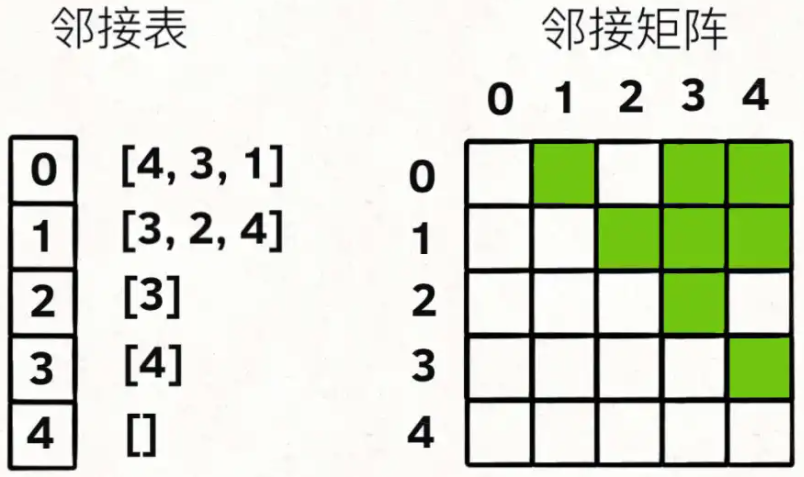

题目：[207. 课程表](https://leetcode-cn.com/problems/course-schedule/)

```go
var (
	visited   []bool
	flags     []bool
	hasCircle bool
)

func canFinish(numCourses int, prerequisites [][]int) bool {
	hasCircle = false
	flags = make([]bool, numCourses)
	visited = make([]bool, numCourses)

	graph := make([][]int, numCourses)
	for i, _ := range prerequisites {
		form, to := prerequisites[i][1], prerequisites[i][0]
		graph[form] = append(graph[form], to)
	}

	for i := 0; i < numCourses; i++ {
		tr207(graph, i)
	}

	return !hasCircle
}

func tr207(graph [][]int, cur int) {
	if flags[cur] {
		// 成环
		hasCircle = true
		return
	}
	if visited[cur] || hasCircle {
		return
	}

	visited[cur] = true
	flags[cur] = true
	for i, _ := range graph[cur] {
		tr207(graph, graph[cur][i])
	}
	flags[cur] = false
}
```


题目：[210. 课程表 II](https://leetcode-cn.com/problems/course-schedule-ii/)

```go
var (
	visited   []bool
	flags     []bool
	hasCircle bool
	res       []int
)

func findOrder(numCourses int, prerequisites [][]int) []int {
	hasCircle = false
	flags = make([]bool, numCourses)
	visited = make([]bool, numCourses)
	res = make([]int, 0, numCourses)

	graph := make([][]int, numCourses)
	for i, _ := range prerequisites {
		form, to := prerequisites[i][0], prerequisites[i][1]
		graph[form] = append(graph[form], to)
	}

	for i := 0; i < numCourses; i++ {
		tr207(graph, i)
	}

	return res
}

func tr207(graph [][]int, cur int) {
	if flags[cur] {
		// 成环
		hasCircle = true
		res = make([]int, 0)
		return
	}
	if visited[cur] || hasCircle {
		return
	}
	visited[cur], flags[cur] = true, true

	for i, _ := range graph[cur] {
		tr207(graph, graph[cur][i])
	}

	if !hasCircle {
		res = append(res, cur)
	}

	flags[cur] = false
}
```

