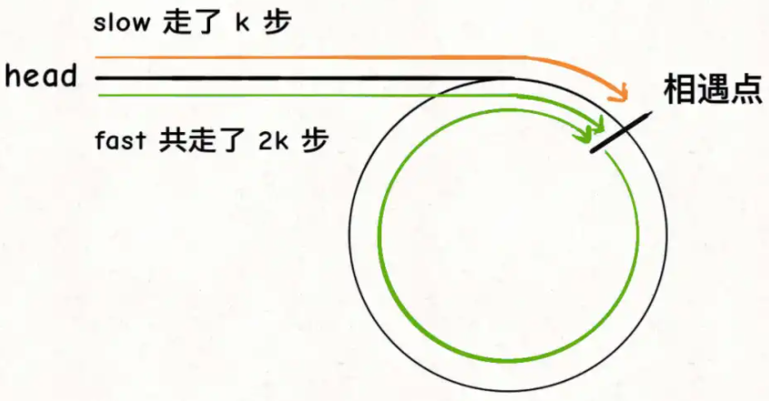
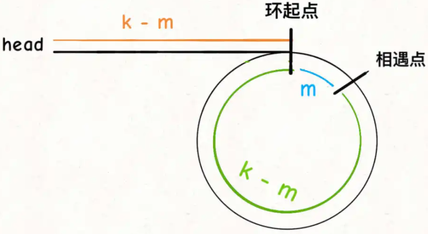
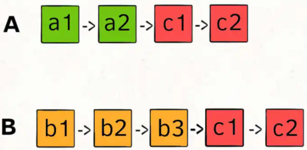
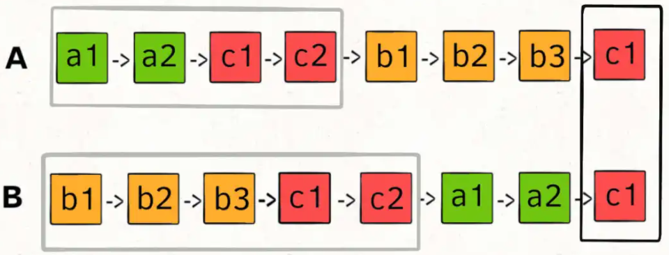

+++

title = "link"
description = "it.algorithm.link"
tags = ["it", "algorithm"]

+++

# link

链表主要技巧：**虚拟头**、**双指针**

## 数据结构

```go
type ListNode struct {
	Val  int
	Next *ListNode
}
```


## 虚拟头

题目：根据数组创建链表

思路：虚拟头指向结果链表

```go
func NewListNode(vs []int) *ListNode {
	// 虚拟头。因为 p 会随着计算变化，因此用一个虚拟头来始终指向结果链表的头部
	vHead := &ListNode{}
	p := vHead

	for _, v := range vs {
		p.Next = &ListNode{Val: v}
		p = p.Next
	}
	return vHead.Next
}
```


## 双指针 虚拟头

### 删除链表的倒数第 N 个结点

题目：[19. 删除链表的倒数第 N 个结点](https://leetcode-cn.com/problems/remove-nth-node-from-end-of-list/)

```shell
输入：head = [1,2,3,4,5], n = 2
输出：[1,2,3,5]

输入：head = [1], n = 1
输出：[]
```

思路

- 找到第 n 个节点：指针 p1、p2 指向 head，先让指针 p1 走 n-1 步，之后 p1、p2 同时前进，p1 走到最后一个节点时，p2 即指向倒数第 n 个节点
- 删除第 n 个节点：单向链表中 p2 无法删除自己，如果让 p1 走 n 步，最终 p2.Next 指向倒数第 n 个节点，返回 head 即可
- 补充：第二种输入头节点即要删除的节点，但 p2 无法删除自己，所以让 p2 在一开始前移一步，并用虚拟头指向结果链表，因为直接 p2.Next.Next 绕过了 head，不能直接返回 head

```go
func removeNthFromEnd(head *ListNode, n int) *ListNode {
	// 前移 p2 一步
	p1, p2 := head, &ListNode{Next: head}
	vHead := p2

	// 找到第 n 个节点
	for i := 1; i < n; i++ {
		p1 = p1.Next
	}
	for p1.Next != nil {
		p1, p2 = p1.Next, p2.Next
	}

	// 删除第 n 个节点
	p2.Next = p2.Next.Next

	return vHead.Next
}
```


## 双指针 虚拟头

### 合并两个有序链表

题目：[21. 合并两个有序链表](https://leetcode-cn.com/problems/merge-two-sorted-lists/)

```shell
输入：l1 = [1,2,4], l2 = [1,3,4]
输出：[1,1,2,3,4,4]
```

思路：虚拟头指向结果链表；双指针循环对比

```go
func mergeTwoLists(l1 *ListNode, l2 *ListNode) *ListNode {
	vHead := &ListNode{}
	p, p1, p2 := vHead, l1, l2

	for p1 != nil && p2 != nil {
		if p1.Val < p2.Val {
			p.Next = p1
			p1 = p1.Next
		} else {
			p.Next = p2
			p2 = p2.Next
		}
		p = p.Next
	}

	if p1 != nil {
		p.Next = p1
	}
	if p2 != nil {
		p.Next = p2
	}

	return vHead.Next
}
```


## 快慢指针

### 链表的中间结点

题目：[876. 链表的中间结点](https://leetcode-cn.com/problems/middle-of-the-linked-list)

```
输入：[1,2,3,4,5]
输出：此列表中的结点 3 (序列化形式：[3,4,5])

输入：[1,2,3,4,5,6]
输出：此列表中的结点 4 (序列化形式：[4,5,6])
由于该列表有两个中间结点，值分别为 3 和 4，我们返回第二个结点。
```

思路

- 快慢指针，指针 pFast 每前进两步，pSlow 只前进一步，pFast 走到最后，pSlow 即指向链表中间节点
- 补充：如果第二个输出取前一个，可以让 pFast 先 Next 一次

```go
func middleNode(head *ListNode) *ListNode {
	pFast, pSlow := head, head

	for pFast != nil && pFast != nil {
		pFast = pFast.Next.Next
		pSlow = pSlow.Next
	}

	return pSlow
}
```


### 链表含环

题目：[141. 环形链表](https://leetcode-cn.com/problems/linked-list-cycle/)（判断是否含环），[142. 环形链表 II](https://leetcode-cn.com/problems/linked-list-cycle-ii/)（找到环起点）


思路

- 判断是否含环：快慢指针，指针 pFast 每前进两步，pSlow 只前进一步，如果 pFast 最终指向空指针则表示无环，如果最终 pFast 与 pSlow 相遇则表示含环

- 找到环起点：pFast 与 pSlow 相遇时，分别走了 2k 和 k 步，则 2k-k=k 为环的长度；假设环起点与相遇点顺时针相距 m，则 head、相遇点都与环起点顺时针相距 k-m，所以让一个指针从 head 出发，另一个指针指向从相遇点出发，这两个指针相遇时的节点即环起点

   

```go
func detectCycle(head *ListNode) *ListNode {
	if head == nil || head.Next == nil {
		return nil
	}

	var hasCycle bool
	pFast, pSlow := head, head

	for pFast != nil && pFast.Next != nil {
		pFast = pFast.Next.Next
		pSlow = pSlow.Next
		if pFast == pSlow {
			hasCycle = true
			break
		}
	}
	// return hasCycle //判断是否函含环到里即可

	// 环起点即 head
	if pFast == head {
		return pFast
	}
	// 环起点非 head
	pFast = head
	for hasCycle {
		pFast, pSlow = pFast.Next, pSlow.Next
		if pFast == pSlow {
			return pFast
		}
	}
	// 无环
	return nil
}
```


### 相交链表

题目：[160. 相交链表](https://leetcode-cn.com/problems/intersection-of-two-linked-lists)


思路：

- 双指针，一个指针从链表 A 开始遍历，遍历完后遍历链表 B，同步的，另一个指针从链表 B 开始遍历，遍历完后遍历链表 B

- 补齐了长度差时，两个指针将同时遍历到两个链表的相交点

   

- 补充：如果无相交，指针 pa 和 pb 会同时等于 nil，所以判断时不要用 pa.Next == nil 或者 pb.Next == nil，否则它们将没有同时等于 nil 的机会

```go
func getIntersectionNode(headA, headB *ListNode) *ListNode {
	pa, pb := headA, headB

	for pa != pb {
		if pa == nil {
			pa = headB
		} else {
			pa = pa.Next
		}
		if pb == nil {
			pb = headA
		} else {
			pb = pb.Next
		}
	}

	return pa
}
```


## 优先级队列

### 合并K个升序链表

题目：[23. 合并K个升序链表](https://leetcode-cn.com/problems/merge-k-sorted-lists/)

```shell

```

思路：优先级队列（二叉堆）

```go
// todo
```

