+++

title = "虚拟化.虚拟网络"
description = "虚拟化.虚拟设备 quick start"
tags = ["techn", "computer", "虚拟化", "虚拟网络", "__quick_start"]

+++

# 虚拟化.虚拟网络

## 虚拟网络设备

### TUN/TAP

> [Linux Tun/Tap 介绍](https://www.zhaohuabing.com/post/2020-02-24-linux-taptun/)；

TUN/TAP 是操作系统内核中**软件实现的虚拟网络设备**，与物理网络设备完全相同的**逻辑**功能。实现上的区别在于：

- 在物理网络设备上**数据以比特流的形式由物理介质承载**，物理网卡从网线接口（或无线信号）接收数据，通过 DMA 拷贝数据到内存，交由内核协议栈处理，发送反之
- 在虚拟网络设备上**数据以字符的形式由内存承载**，发送数据时，协议栈将数据交给，虚拟网卡从字符设备（文件）接受数据

TUN 模拟 L3 网络层设备；TAP 模拟 L2 链路层设备，以太网（Ethernet）网卡。

### veth pair

> [Linux veth pair 详解](https://zhuanlan.zhihu.com/p/293659939)；
>
> [Linux 虚拟网络设备 veth-pair 详解](https://www.cnblogs.com/bakari/p/10613710.html)；

veth 设备均为成对使用

## 隧道网络

### vxlan

> [VLAN和VXLAN的区别](https://community.cisco.com/t5/%E7%BD%91%E7%BB%9C%E5%8D%9A%E5%AE%A2/%E5%81%9A%E4%BA%86%E5%87%A0%E5%B9%B4%E7%9A%84%E7%BD%91%E5%B7%A5%E4%B9%9F%E6%9C%AA%E5%BF%85%E4%BA%86%E8%A7%A3vlan%E5%92%8Cvxlan%E7%9A%84%E5%8C%BA%E5%88%AB-%E4%BB%8A%E5%A4%A9%E6%88%91%E6%9D%A5%E5%91%8A%E8%AF%89%E4%BD%A0/ba-p/4383418)；
>
> [linux 上实现 vxlan 网络](https://cizixs.com/2017/09/28/linux-vxlan/)；

vlan（虚拟局域网）将同一网络划分为多个逻辑上的虚拟子网，在以太网的基础上实现了广播域隔离，解决了广播报文泛滥的问题；

vxlan 将 header 扩展到了 8 字节，支撑如今云服务等大规模场景，解决网络地址重叠问题以满足多租户场景

### ipip

### bgp

## 组网模式
