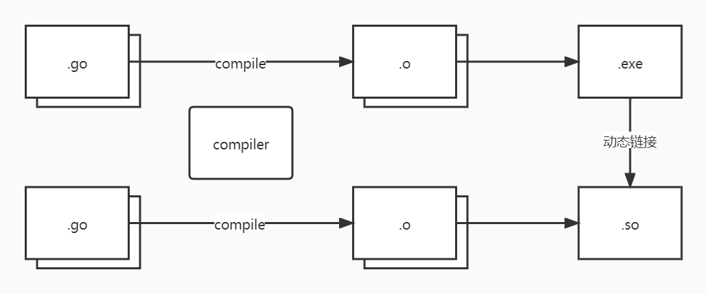

+++

title = "go.cmd"
description = "go.cmd"
tags = ["it", "go"]

+++

# go.cmd


### go build

#### -tags & //go:build

准备项目实例

```shell
tree
.
├── cmd
│   └── main.go
├── go.mod
└── pkg
    └── registry
        ├── index.go
        └── pprof.go
```

cmd/main.go

```go
package main

import (
	"net/http"
	_ "yuanyatianchi.io/go/tools/build/tags/pkg/registry"
)

func main() {
	http.ListenAndServe("127.0.0.1:8080", nil)
}
```

pkg/registry/index.go

```go
//go:build linux && amd64 && !disable_index

package registry

import "net/http"

func init() {
	println("index register")
}

func Index(w http.ResponseWriter, r *http.Request) {
	w.Write([]byte(`<a href="http://127.0.0.1:8080/debug/pprof/">pprof</a>`))
}
```

pkg/registry/pprof.go

```go
//go:build (linux || darwin) && (amd64 || arm64) && enable_pprof

package registry

import _ "net/http/pprof"

func init() {
	println("pprof register")
}

```

`//go:build` 最终为 true 时，当前文件则被编译，否则不被编译。语法解释如下：

- `linux`：`GOOS="linux"` 时为 true
- `amd64`：`GOHOSTARCH="amd64"` 时为 true
- `!disable_index`：`go build` 选项 `-tags` 中有 `disable_index` 为 false，缺省为 true
- `enable_pprof`：`go build` 选项 `-tags` 中有 `enable_pprof` 为 true，缺省为 false
- `&&`：与
- `||`：或

```shell
$ go build -o main cmd/main.go && ./main
index register

$ go build -tags enable_pprof -o main cmd/main.go && ./main
index register
pprof register

$ go build -tags="enable_pprof disable_index" -o main cmd/main.go && ./main
pprof register
```


> 注意：如果包内所有内容都不被编译，将报错`imports <pakage_import_path>: build constraints exclude all Go files in <pakage_path>`，即构建约束排除了包中的所有 Go 文件，如下
>
> ```shell
> $ go build -tags disable_index -o main cmd/main.go && ./main
> package command-line-arguments
>      imports yuanyatianchi.io/go/tools/build/tags/pkg/registry: build constraints exclude all Go files in /root/go/path/src/yuanyatianchi.io/go/tools/build/tags/pkg/registry
> ```
>
> 须**确保包内至少有一个文件可以编译**。


### go tool pprof

https://golang.org/cmd/pprof/

https://juejin.cn/post/6844903588565630983

使用 pprof 分析分为两步：

- 数据采样：`runtime/pprof`、`net/http/pprof`、`go test`；
- 数据分析：`go tool pprof`。

#### 数据采样

pprof 数据采样方式:

- [runtime/pprof](https://pkg.go.dev/runtime/pprof): 手动调用`runtime.StartCPUProfile`或者`runtime.StopCPUProfile`等 API 来生成和写入采样文件，也是后两种方式的基础，优点是灵活性高；
- [net/http/pprof](https://pkg.go.dev/net/http/pprof): 通过 http 服务获取 profile 采样文件，简单易用，适用于对应用程序的整体监控；
- **go test**: 通过 `go test -bench . -cpuprofile prof.cpu`生成采样文件 适用对函数进行针对性测试。

##### runtime/pprof

参考 [runtime/pprof 源码](https://go.dev/src/runtime/pprof) ，或者 [net/http/pprof 源码](https://go.dev/src/net/http/pprof) 实现。

##### net/http/pprof

通过 `import _ "net/http/pprof"`，其 init 函数将注册获取数据采样的 http Handler。访问[首页](http://localhost:8080/debug/pprof)查看详情。

```go
package main

import (
   "net/http"
   _ "net/http/pprof"
)

func main() {
   http.ListenAndServe("127.0.0.1:8080", nil)
}
```


访问内存采样地址 http://localhost:8080/debug/pprof/heap?debug=1，有 debug 参数，其值含义如下：

- debug=0：缺省值，获取数据采样文件，内容是不可人为解读的函数地址列表，需要结合 pprof 工具才能还原函数名；
- debug=1：将把函数地址转换为函数名，可以脱离 pprof 工具在浏览器中直接查看；
- debug=2：仅 goroutine 支持，将以 unrecovered panic 的格式打印堆栈，可读性更高。


其他 profile 数据采样获取地址与内存如出一辙：http://localhost:8080/debug/pprof/<profile-name>

以下是以 runtime/pprof.Profile 为结构体的 profile

- goroutine：所有当前 goroutine 的堆栈跟踪
- threadcreate：导致创建新操作系统线程的堆栈跟踪
- heap：活动对象的内存分配示例。 您可以指定 gc GET 参数以在获取堆样本之前运行 GC。
- allocs：所有过去内存分配的样本
- block：导致同步原语阻塞的堆栈跟踪
- mutex：争用互斥锁持有者的堆栈跟踪

以下是因为各种原因未整合到 runtime/pprof.Profile 结构中 profile

- cmdline：当前程序的命令行调用
- profile：CPU 配置文件。 您可以在 seconds GET 参数中指定持续时间（缺省值30s）。 获取配置文件后，使用 go tool pprof 命令调查配置文件。
- trace：当前程序的执行轨迹。 您可以在 seconds GET 参数中指定持续时间（缺省值1s）。 获取跟踪文件后，使用 go tool trace 命令调查跟踪。

##### go test

通常用`net/http/pprof`或`runtime/pprof`对应用进行整体分析，找出热点后，再用`go test`进行基准测试，进一步确定热点加以优化并对比测试。

```shell
# 生成 test 二进制文件， pprof 工具需要用到
go test -c -o tmp.test 
# 执行基准测试 BenchAbc，并忽略任何单元测试，test flag前面需要加上'test.'前缀
tmp.test -test.bench BenchAbc -test.run XXX test.cpuprofile cpu.prof     
# 与上面两条命令等价，只不过没有保留 test 二进制文件
go test -bench BenchAbc -run XXX -cpuprofile=cpu.prof .
```

`go test`可以直接加`-cpuprofile` `-mutexprofilefraction`等参数实现prof数据的采样和生成，更多相关参数参考 `go test -h`。

#### 数据分析

以[Profiling Go Programs](https://link.juejin.cn/?target=https%3A%2F%2Fblog.golang.org%2Fprofiling-go-programs)中的[示例代码](https://link.juejin.cn/?target=https%3A%2F%2Fgithub.com%2Frsc%2Fbenchgraffiti)为例


```shell
# 进入 pprof 模式
$ go tool pprof havlak1 havlak1.prof

# 在浏览器查看图形化数据
$(pprof) web
```

```shell
$ go tool pprof havlak3 havlak3.mprof
```


#### 源码解读


https://golang.org/cmd/，https://pkg.go.dev/cmd

| **Name**                                       | **Synopsis**                                                 |
| ---------------------------------------------- | ------------------------------------------------------------ |
| [addr2line](https://golang.org/cmd/addr2line/) | Addr2line is a minimal simulation of the GNU addr2line tool, just enough to support pprof. |
| [api](https://golang.org/cmd/api/)             | Binary api computes the exported API of a set of Go packages. |
| [asm](https://golang.org/cmd/asm/)             | Asm, typically invoked as “go tool asm”, assembles the source file into an object file named for the basename of the argument source file with a .o suffix. |
| [buildid](https://golang.org/cmd/buildid/)     | Buildid displays or updates the build ID stored in a Go package or binary. |
| [cgo](https://golang.org/cmd/cgo/)             | Cgo enables the creation of Go packages that call C code.    |
| [compile](https://golang.org/cmd/compile/)     | Compile, typically invoked as “go tool compile,” compiles a single Go package comprising the files named on the command line. |
| [cover](https://golang.org/cmd/cover/)         | Cover is a program for analyzing the coverage profiles generated by 'go test -coverprofile=cover.out'. |
| [dist](https://golang.org/cmd/dist/)           | Dist helps bootstrap, build, and test the Go distribution.   |
| [doc](https://golang.org/cmd/doc/)             | Doc (usually run as go doc) accepts zero, one or two arguments. |
| [fix](https://golang.org/cmd/fix/)             | Fix finds Go programs that use old APIs and rewrites them to use newer ones. |
| [go](https://golang.org/cmd/go/)               | Go is a tool for managing Go source code.                    |
| [gofmt](https://golang.org/cmd/gofmt/)         | Gofmt formats Go programs.                                   |
| [link](https://golang.org/cmd/link/)           | Link, typically invoked as “go tool link”, reads the Go archive or object for a package main, along with its dependencies, and combines them into an executable binary. |
| [nm](https://golang.org/cmd/nm/)               | Nm lists the symbols defined or used by an object file, archive, or executable. |
| [objdump](https://golang.org/cmd/objdump/)     | Objdump disassembles executable files.                       |
| [pack](https://golang.org/cmd/pack/)           | Pack is a simple version of the traditional Unix ar tool.    |
| [pprof](https://golang.org/cmd/pprof/)         | Pprof interprets and displays profiles of Go programs.       |
| [test2json](https://golang.org/cmd/test2json/) | Test2json converts go test output to a machine-readable JSON stream. |
| [trace](https://golang.org/cmd/trace/)         | Trace is a tool for viewing trace files.                     |
| [vet](https://golang.org/cmd/vet/)             | Vet examines Go source code and reports suspicious constructs, such as Printf calls whose arguments do not align with the format string. |


## go tool compile

作用：编译单个由命令行上输入名字的文件组成的 Go 包，通常通过`go tool compile`调用

```shell
# 直接输入 go tool compile 获取帮助信息
$ go tool compile
...
```

语法：`go tool compile [options] file.go...`

参数（常用）

- `-S`：汇编列表打印到标准输出（仅代码）。可以看到汇编代码。
- `-S -S`：汇编列表打印到标准输出（代码 & 数据）。
- `-N`：禁用优化。golang 编译过程中可能会进行一些优化，会使汇编代码与源代码过程不完全一致。
- `-l`：禁用内联。
- `-I dir1 -I dir2 ...`：在查询 `$GOROOT/pkg/$GOOS_$GOARCH` 目录后，在 dir1、dir2 等中搜索导入的包

#### -S

var.go

```go
package main

var a = 1
```

```shell
$ go tool compile -N -l -S var.go
go.cuinfo.packagename. SDWARFCUINFO dupok size=0
        0x0000 6d 61 69 6e                                      main
""..inittask SNOPTRDATA size=24
        0x0000 00 00 00 00 00 00 00 00 00 00 00 00 00 00 00 00  ................
        0x0010 00 00 00 00 00 00 00 00                          ........
"".a SNOPTRDATA size=8
        0x0000 01 00 00 00 00 00 00 00                          ........
```

#### -I


### 编译文件

表面上看来，编译器将相互依赖的多个源文件编译为一个可执行文件，但实际上编译器一次只能编译一个源文件为 .o 文件，最终将所有 .o 文件构建为一个 .exe 文件

编译器同样可以将相互依赖的多个源文件编译为一个动态链接库文件，.so 文件由 .exe 文件运行时[动态加载](it.lang.go.lib.plugin)。



- .o：object，(静态)对象，静态链接库文件
- .so: share object，共享对象，动态链接库文件，等同于 Windows 上的 .dll (Dynamic Link Library) 。
- .a：静态链接库文件，
- .exe: executable，可执行文件


这里通过一个例子演示哥哥文件之间的关系，项目内容如下（todo：加入加载 .so 文件）

```shell
$ tree
.
├── go.mod
├── main.go
└── static
    ├── add.go
    └── static.go
```

```go
// main.go
package main

import (
	"fmt"
	"yuanyatianchi.io/gocompile/static"
)

func main() {
	fmt.Println(static.Add(1, 2))
}
```

```go
// static/static.go
package static

func Add(m, n int) int {
	return doAdd(m, n)
}
```

```go
// static/add.go
package static

func doAdd(m, n int) int {
	return m + n
}
```

1. 编译依赖包：先通过`go build`将 static 包内的 .go 文件编译为一个 .a 文件
   - 因为 .a 文件本身是作为包（库）存在的，无论是编译一个文件还是编译一整个包内的文件，都只生成一个 .a 目标文件。
   - 之所以使用 其实在 go1.16 之前可以通过 `go install ./static/ `这样，但是在 go1.16 及之后`go install`不再自动安装不带 main 函数的包到`$GOROOT/pkg/$GOOS_$GOARCH/`目录下了。
   - .a 文件的保存位置，必须是`$GOROOT/pkg/$GOOS_$GOARCH/`下，否则编译器会找不到，这是必要前提条件
2. 编译主程序目标文件：通过`go tool compile`将 main.go 编译为一个 .o 文件
   - 编译器要找到静态链接库，是根据`go tool compile 的 -I 参数指定的路径`+`import该包时的字符串`+`.a`这样的一个全路径构成。
   - 因为 .a 文件首先必须满足被放在`$GOROOT/pkg/$GOOS_$GOARCH/`下，所以一般情况下`-I`指定为`$GOROOT/pkg/$GOOS_$GOARCH/`即可，结合前面代码，导入该静态包使用`yuanyatianchi.io/gocompile/static`这样的路径，即 .a 文件的全路径为`$GOROOT/pkg/$GOOS_$GOARCH/`+`yuanyatianchi.io/gocompile/static`+`.a`
   - 当然实际上完全也可以使用像`$GOROOT/pkg/$GOOS_$GOARCH/yuanyatianchi.io/`+`gocompile/static`+`.a`这样的组合
3. 编译主程序可执行文件：通过`go tool link`将 main.o 编译为一个可执行文件文件

```shell
# 将 static 包内的 .go 文件编译为一个 static.a 文件
$ go build -o $GOROOT/pkg/$GOOS_$GOARCH/yuanyatianchi.io/gocompile/static.a ./static/

# 可以删除 static 包下的所有 .go 文件，以演示导入静态链接库的效果
$ rm -f static/*.go

# 将 main.go 编译为一个 .o 文件
$ go tool compile -I $GOROOT/pkg/$GOOS_$GOARCH/ main.go

# 将 main.o 编译为一个可执行文件文件
$ go tool link -L $GOROOT/pkg/$GOOS_$GOARCH/ -o main main.o

# 执行可执行文件，看是否可以正常执行
$ ./main
3
```


### 编译器指令

[编译器指令](https://pkg.go.dev/cmd/compile#hdr-Compiler_Directives)：编译器接受注释形式的指令

#### go:linkname

因为这个指令可以颠覆类型系统和包模块化，所以它只在导入了“不安全”的文件中启用


语法如下

```go
//go:linkname localname [importpath.name]
```

代码如下，将 add 方法链接到 static 包下的 Add 方法

```go
func main() {
	i := add(1, 2)
	fmt.Println(i)
	fmt.Println(unsafe.Pointer(&i))
}

//go:linkname add static.Add
func add(m, n int) int {
	return m + n
}
```

```shell
$ go run main.go
3
0xc00001c0f8
```


#### inline & noinline

Go编译器的内敛优化，即在编译期间，将简短的函数（越简短的函数调用开销占总开销比例越大）在调用它的地方展开（用函数内容替换调用），可以消除函数调用本身的运行时开销，以及更高效的执行其它优化策略

```go
//go:noinline
func Max(a, b int) int {
	if a > b {
		return a
	}
	return b
}

func BenchmarkMax(b *testing.B) {
	var result int
	for i := 0; i < b.N; i++ {
		result = Max(result, i)
	}
}
```

```shell
$ go test -bench .
goos: linux
goarch: amd64
pkg: yuanyatianchi.io/go/tool/compile
cpu: 11th Gen Intel(R) Core(TM) i7-11800H @ 2.30GHz
BenchmarkMax-2          843167469                1.343 ns/op
PASS
ok      yuanyatianchi.io/go/tool/compile        1.291s

```

移除 Max 函数上的编译器指令 `//go:noinline`，可以看到在内联之后，程序执行的耗时显著降低

```shell
$ go test -bench .
goos: linux
goarch: amd64
pkg: yuanyatianchi.io/go/tool/compile
cpu: 11th Gen Intel(R) Core(TM) i7-11800H @ 2.30GHz
BenchmarkMax-2          1000000000               0.2489 ns/op
PASS
ok      yuanyatianchi.io/go/tool/compile        0.279s
```

当 Max 函数被内联后，BenchmarkMax 呈现给编译器的样子，看起来这样的

```go
func BenchmarkMax(b *testing.B) {
	var result int
	for i := 0; i < b.N; i++ {
		if result > i {
			result = result
		} else {
			result = i
		}
	}
}
```

[内联和叶内联与堆栈中内联的限制](https://dave.cheney.net/2020/05/02/mid-stack-inlining-in-go)：**内联会导致更多的编译时间和更大的二进制文件，以换取更快的执行时间**。

```go
func small() string {
	s := "hello, " + "world!"
	return s
}

func large() string {
	s := "a"
	s += "b"
	s += "c"
	s += "d"
	s += "e"
	s += "f"
	s += "g"
	s += "h"
	s += "i"
	s += "j"
	s += "k"
	s += "l"
	s += "m"
	s += "n"
	s += "o"
	s += "p"
	s += "q"
	s += "r"
	s += "s"
	s += "t"
	s += "u"
	s += "v"
	s += "w"
	s += "x"
	s += "y"
	s += "z"
	return s
}

func main() {
	small()
	large()
}
```

通过 `go tool compile -m` 或者 `go build -gcflags=-m` 打印编译器优化决策，分配给每个函数的成本

```shell
$ go tool compile -m=2 inline.go
inline.go:3:6: can inline small with cost 7 as: func() string { s := "hello, " + "world!"; return s }
inline.go:8:6: cannot inline large: function too complex: cost 82 exceeds budget 80
inline.go:38:6: can inline main with cost 68 as: func() { small(); large() }
inline.go:39:7: inlining call to small
```

通过 `go tool compile -l` 或者 `go build -gcflags=-l` 可以一定程度上控制内联决策：

- `-l=0` 是内联的默认级别；
- `-l` 或 `-l=1` 禁用内联；
- `-l=2` 和 `-l=3` 目前未使用，对 `-l=0` 无影响；
- `-l=4` 降低了内联非叶函数和通过接口调用的成本。

注意：官方注释中说明[超过 `-l` 可能是错误，且不受支持](https://github.com/golang/go/blob/be08e10b3bc07f3a4e7b27f44d53d582e15fd6c7/src/cmd/compile/internal/gc/inl.go#L11)。


#### linkname

> symbol：符号，在 Golang 中普遍表示变量或函数的泛称

此特殊指令使其后的 Go 代码不应用，作为替代， `//go:linkname` 指令指示编译器使用 importpath.name 作为**源代码中声明为 localname 的变量或函数**的目标文件符号名称（即调用 local symbol 则实际将调用 importpath.name 所指向的 symbol）。如果省略 importpath.name 参数，则该指令使用 symbol 的默认目标文件符号名称，并且仅具有使其他包可以访问该 symbol 的效果。因为这个指令可以颠覆类型系统和包的模块化，所以它只在导入了 unsafe 包中的文件中启用。

```go
//go:linkname localname [importpath.name]
```

准备项目，做一个简单实践

```shell
$ tree
.
├── cmd
│   └── linkname.go
├── go.mod
└── pkg
    └── compute
        └── add.go

3 directories, 3 files
```

go. mod

```mod
module yuanyatianchi.io/go/tool/compile/linkname

go 1.18
```

cmd/linkname.go

```go
package main

import (
	"fmt"
	"unsafe"

	_ "yuanyatianchi.io/go/tool/compile/linkname/pkg/compute" // importpath
)

func main() {
	a := add(1, 2)

	pointer := unsafe.Pointer(&a)

	fmt.Println(a, pointer)
}

// `//go:linkname` 一般写在无体函数上一行，当然也可以不这么做，但必须在一个文件内，否则将编译出错
//go:linkname add yuanyatianchi.io/go/tool/compile/linkname/pkg/compute.Add
func add(m, n int) int
```

pkg/compute/add.go

```go
package compute

func Add(m, n int) int {
	return m + n
}
```

通过 `go tool compile` 和 `go tool link` 编译链接，即可得到可执行文件

```shell
$ go tool compile -o static/yuanyatianchi.io/go/tool/compile/linkname/pkg/compute.a ./pkg/compute/*
$ go tool compile -I static/ cmd/linkname.go
$ go tool link -L static/ -o linkname linkname.o
$ ls && ./linkname
cmd  go.mod  linkname  linkname.o  pkg  static
3 0xc0000aa000
```

`go build cmd/linkename.go && ./linkname` 或 `go run cmd/linkname.go` 亦可

```shell
$ go build -o linkname cmd/linkname.go && ./linkname
3 0xc0000aa000

$ go run cmd/linkname.go
3 0xc0000aa000
```


### 汇编指令


### DEBUG


## go tool objdump

作用：反汇编可执行文件。打印二进制文件（.o）中所有文本符号（代码）的反汇编

```shell
# 直接输入 go tool compile 获取帮助信息
$ go tool objdump
...
```

语法：`go tool objdump [-S] [-gnu] [-s symregexp] binary [start end]`

参数（常用）

- `-S`：与汇编一起打印 Go 代码。
- `-s regex`：反汇编名称与正则表达式匹配的 symbols (类型、函数、变量等)。
- `-gnu`：在 Go 程序集旁边打印 GNU 程序集（如果支持）。

```shell
# 编译生成 .o 文件
$ go tool compile -N -l add.go
# 反编译
$ go tool objdump add.o
TEXT "".add(SB) gofile..root/it.lang.go/gopath/src/yuanyatianchi.io/go/cmd/add.go
  add.go:3              0x392                   4883ec10                SUBQ $0x10, SP
  add.go:3              0x396                   48896c2408              MOVQ BP, 0x8(SP)
  add.go:3              0x39b                   488d6c2408              LEAQ 0x8(SP), BP
  add.go:3              0x3a0                   4889442418              MOVQ AX, 0x18(SP)
  add.go:3              0x3a5                   48895c2420              MOVQ BX, 0x20(SP)
  add.go:3              0x3aa                   48c7042400000000        MOVQ $0x0, 0(SP)
  add.go:4              0x3b2                   488b442418              MOVQ 0x18(SP), AX
  add.go:4              0x3b7                   4803442420              ADDQ 0x20(SP), AX
  add.go:4              0x3bc                   48890424                MOVQ AX, 0(SP)
  add.go:4              0x3c0                   488b6c2408              MOVQ 0x8(SP), BP
  add.go:4              0x3c5                   4883c410                ADDQ $0x10, SP
  add.go:4              0x3c9                   c3                      RET
```

```shell
# `-S`：与汇编一起打印 Go 代码。
$ go tool objdump -S add.o
TEXT "".add(SB) gofile..D:/it/go/goproject/yuanyatianchi/cmd/demo/add.go
func add(m, n int) int {
  0x392                 4883ec10                SUBQ $0x10, SP
  0x396                 48896c2408              MOVQ BP, 0x8(SP)
  0x39b                 488d6c2408              LEAQ 0x8(SP), BP
  0x3a0                 4889442418              MOVQ AX, 0x18(SP)
  0x3a5                 48895c2420              MOVQ BX, 0x20(SP)
  0x3aa                 48c7042400000000        MOVQ $0x0, 0(SP)
        return m + n
  0x3b2                 488b442418              MOVQ 0x18(SP), AX
  0x3b7                 4803442420              ADDQ 0x20(SP), AX
  0x3bc                 48890424                MOVQ AX, 0(SP)
  0x3c0                 488b6c2408              MOVQ 0x8(SP), BP
  0x3c5                 4883c410                ADDQ $0x10, SP
  0x3c9                 c3                      RET
```

```shell
# `-s regex`：反汇编名称与正则表达式匹配的 symbols (类型、函数、变量等)。因为这里只有一个 add 方法，所以与前面没什么区别
$ go tool objdump -s add add.o
TEXT "".add(SB) gofile..root/it.lang.go/gopath/src/yuanyatianchi.io/go/cmd/add.go
  add.go:3              0x392                   4883ec10                SUBQ $0x10, SP
  add.go:3              0x396                   48896c2408              MOVQ BP, 0x8(SP)
  add.go:3              0x39b                   488d6c2408              LEAQ 0x8(SP), BP
  add.go:3              0x3a0                   4889442418              MOVQ AX, 0x18(SP)
  add.go:3              0x3a5                   48895c2420              MOVQ BX, 0x20(SP)
  add.go:3              0x3aa                   48c7042400000000        MOVQ $0x0, 0(SP)
  add.go:4              0x3b2                   488b442418              MOVQ 0x18(SP), AX
  add.go:4              0x3b7                   4803442420              ADDQ 0x20(SP), AX
  add.go:4              0x3bc                   48890424                MOVQ AX, 0(SP)
  add.go:4              0x3c0                   488b6c2408              MOVQ 0x8(SP), BP
  add.go:4              0x3c5                   4883c410                ADDQ $0x10, SP
  add.go:4              0x3c9                   c3                      RET
```

```shell
# `-gnu`：在 Go 程序集旁边打印 GNU 程序集（如果支持）。
$ go tool objdump -gnu add.o
  add.go:3              0x392                   4883ec10                SUBQ $0x10, SP                       // sub $0x10,%rsp
  add.go:3              0x396                   48896c2408              MOVQ BP, 0x8(SP)                     // mov %rbp,0x8(%rsp)
  add.go:3              0x39b                   488d6c2408              LEAQ 0x8(SP), BP                     // lea 0x8(%rsp),%rbp
  add.go:3              0x3a0                   4889442418              MOVQ AX, 0x18(SP)                    // mov %rax,0x18(%rsp)
  add.go:3              0x3a5                   48895c2420              MOVQ BX, 0x20(SP)                    // mov %rbx,0x20(%rsp)
  add.go:3              0x3aa                   48c7042400000000        MOVQ $0x0, 0(SP)                     // movq $0x0,(%rsp)
  add.go:4              0x3b2                   488b442418              MOVQ 0x18(SP), AX                    // mov 0x18(%rsp),%rax
  add.go:4              0x3b7                   4803442420              ADDQ 0x20(SP), AX                    // add 0x20(%rsp),%rax
  add.go:4              0x3bc                   48890424                MOVQ AX, 0(SP)                       // mov %rax,(%rsp)
  add.go:4              0x3c0                   488b6c2408              MOVQ 0x8(SP), BP                     // mov 0x8(%rsp),%rbp
  add.go:4              0x3c5                   4883c410                ADDQ $0x10, SP                       // add $0x10,%rsp
  add.go:4              0x3c9                   c3                      RET                                  // retq
```


## go tool pprof

### net/http/pprof 采样

项目


